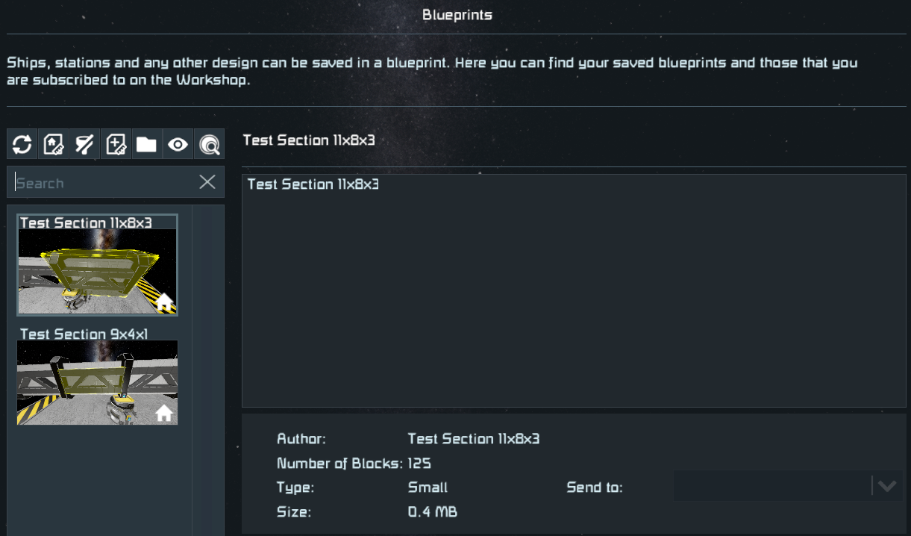

# Sections

**Sections** is a **Space Engineers plugin**, which allows for **selecting part of a grid**, then copying, cutting, deleting or blueprinting the blocks inside the selection box.

**This is an implementation of a publicly announced Space Engineers 2 feature** for the current version of the game. It is so useful, that I could not stand not implementing it. Sorry. :)

This is an implementation of a publicly announced Space Engineers 2 feature
for the current version of the game. It is so useful, that I could not stand
not implementing it. Sorry. :)

For support please [join the SE Mods Discord](https://discord.gg/PYPFPGf3Ca).

Please consider supporting my work on [Patreon](https://www.patreon.com/semods) or one time via [PayPal](https://www.paypal.com/paypalme/vferenczi/).

*Thank you and enjoy!*

## Prerequisites

- [Space Engineers](https://store.steampowered.com/app/244850/Space_Engineers/)
- [Plugin Loader](https://github.com/sepluginloader/SpaceEngineersLauncher)

## Installation

1. Install Plugin Loader's [Space Engineers Launcher](https://github.com/sepluginloader/SpaceEngineersLauncher)
2. Run the game
3. In the new **Plugins** menu add the **Sections** plugin
4. Apply and restart the game as requested

## Features

- [Demo Video](https://www.youtube.com/watch?v=W0S-wIaIZ80)
- [Test World](https://steamcommunity.com/sharedfiles/filedetails/?id=3386716105)

This plugin is designed for offline ship design. It works only in creative mode.
It is availabel in survival mode only if the creative mode tools are enabled for the player.

### Selecting grid sections

Start your selection by pressing the **NumPad 0** key. It is rebindable in the configuration,
should you play on a keyboard without a numpad.

Follow the hints shown on the screen. You do **not** need to hold a block in hand
for the selection to work, actually it would just be in the way. I suggest pressing
`0` to deselect anything held in hand to clear up your view.

### Resizing the selection box

Adjust the selection box as needed:
- **Block rotation keys**: Grow the selection box. Hold down **shift** to **shrink**.
- **R key**: Resets the selection box to its initial size.

You are free to fly around while right-sizing the selection box.
It is helpful, since you will likely need to check the other side
or inside your ship as well.

The keys used here are different from  the ones seen in the SE2 reveal video
in order to allow for flying around while resizing the selection box.

### Section operations

Once the selection is good, you can do these operations on the selected blocks:
- **Left mouse button**: Copy the section to the clipboard, so it can be pasted elsewhere.
- **Right mouse button**: Cut the section (copy, then delete), so it can be moved elsewhere.
- **Backspace key**: Delete the blocks in the section. It may result in a grid split, so careful.
- **Enter key**: Make a blueprint out of the blocks inside the section. They will be stored locally in the `Sections` blueprint folder.

By default, only the blocks fully enclosed in the selection box are operated on.

You can hold down the **Ctrl** key while using the above section operations to include
the blocks intersecting the surface of the selection box without being fully contained.

### Managing saved sections

You can paste your saved sections efficiently using the existing blueprint functionality.

Configure the Blueprints dialog (F10) this way:
- Select only the Home source for blueprints, so it lists only local files
- Open the `Sections` folder: Click on the folder icon above the search box, then double-click on `Sections`

This way you can press F10 and quick search immediately in the saved sections.

The `Sections` folder will be created automatically when you save your first section.

The sections are saved with the grid names, plus numbering to avoid overwriting.
The numbering works exactly the same way as saving blueprints with Ctrl-B.

The sections have thumbnails generated from a screenshot taken when the section
is saved. Position your character to have a good view before saving the section,
if possible. If not, then you can make a new screenshot in the blueprints dialog.

### Pasting sections

The vanilla game sets the drag point of pasted blueprints to the center of their bounding sphere.
Not to mention, this is very suboptimal for sections, because it works well only if you try to
align a block near the center of the blueprint.

For example, let's consider this corner girder section. 
Notice the blue cube at the far corner, that's the origin block faced while making the blueprint.
That's why it is at the dead center of the blueprint's thumbnail:

If you're trying to paste it on top of the other corner in the vanilla game, 
then it is impossible to align properly:

With the fix implemented in this plugin you can just face where the origin block should go:

Certainly you have to make sure first, that the rotation is right, but that's already second nature...

## Configuration

Press `Ctrl-Alt-/` while in-game and not in the GUI. It will open the list of
configurable plugins. Select **Sections** from the list to configure this plugin.
Alternatively you can open the settings by double-clicking on this plugin in the Plugins
dialog of Plugin Loader, then clicking **Settings** in the dialog opened.
The configuration can be changed anytime without having to restart the game.

## Limitations

- The selection box can cover blocks and operate only on a single grid.
- Sections can store blocks from a single grid only (without subgrids).
- Pasting sections with disconnected blocks works as expected, but may result in "floating" blocks.
- The plugin is largely untested in survival and should **not** be used in multiplayer.

## Troubleshooting

Should you have any issues using this plugin, then please either submit a ticket here
on GitHub or report the issue in the `#bug-reports` channel of the [SE Mods Discord](https://discord.gg/PYPFPGf3Ca).

## Legal

Space Engineers and Space Engineers 2 are trademarks of Keen Software House s.r.o.

## Want to know more?

- [SE Mods Discord](https://discord.gg/PYPFPGf3Ca) FAQ, Troubleshooting, Support, Bug Reports, Discussion
- [Plugin Loader Discord](https://discord.gg/6ETGRU3CzR) Everything about plugins
- [YouTube Channel](https://www.youtube.com/channel/UCc5ar3cW9qoOgdBb1FM_rxQ)
- [Source code](https://github.com/viktor-ferenczi/toolbar-manager)
- [Bug reports](https://discord.gg/x3Z8Ug5YkQ)

## Credits

### Patreon Supporters

_in alphabetical order_

#### Admiral level
- BetaMark
- Casinost
- Mordith - Guardians SE
- Robot10
- wafoxxx

#### Captain level
- Diggz
- jiringgot
- Jimbo
- Kam Solastor
- lazul
- Linux123123
- Lotan
- Lurking StarCpt
- NeonDrip
- NeVaR
- opesoorry

#### Testers
- Avaness
- mkaito

### Creators
- avaness - Plugin Loader
- Fred XVI - Racing maps
- Kamikaze - M&M mod
- LTP
- Mordith - Guardians SE
- Mike Dude - Guardians SE
- SwiftyTech - Stargate Dimensions

**Thank you very much for all your support!**